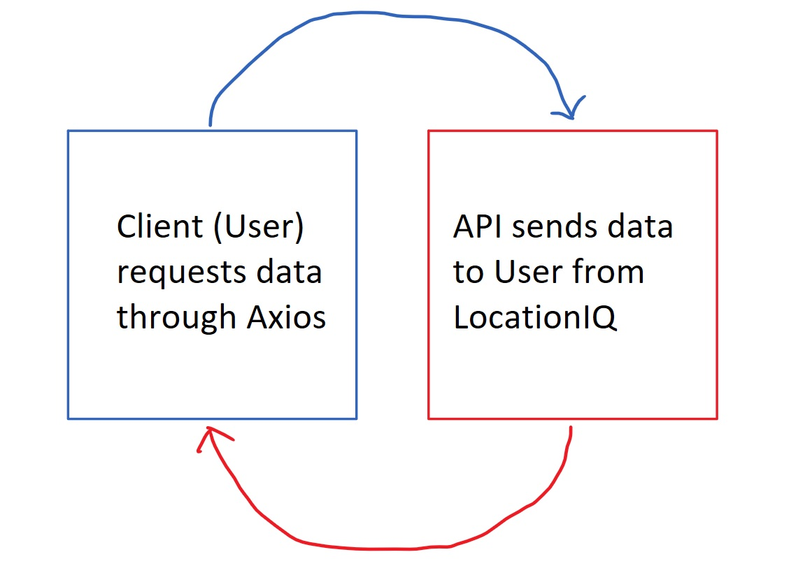
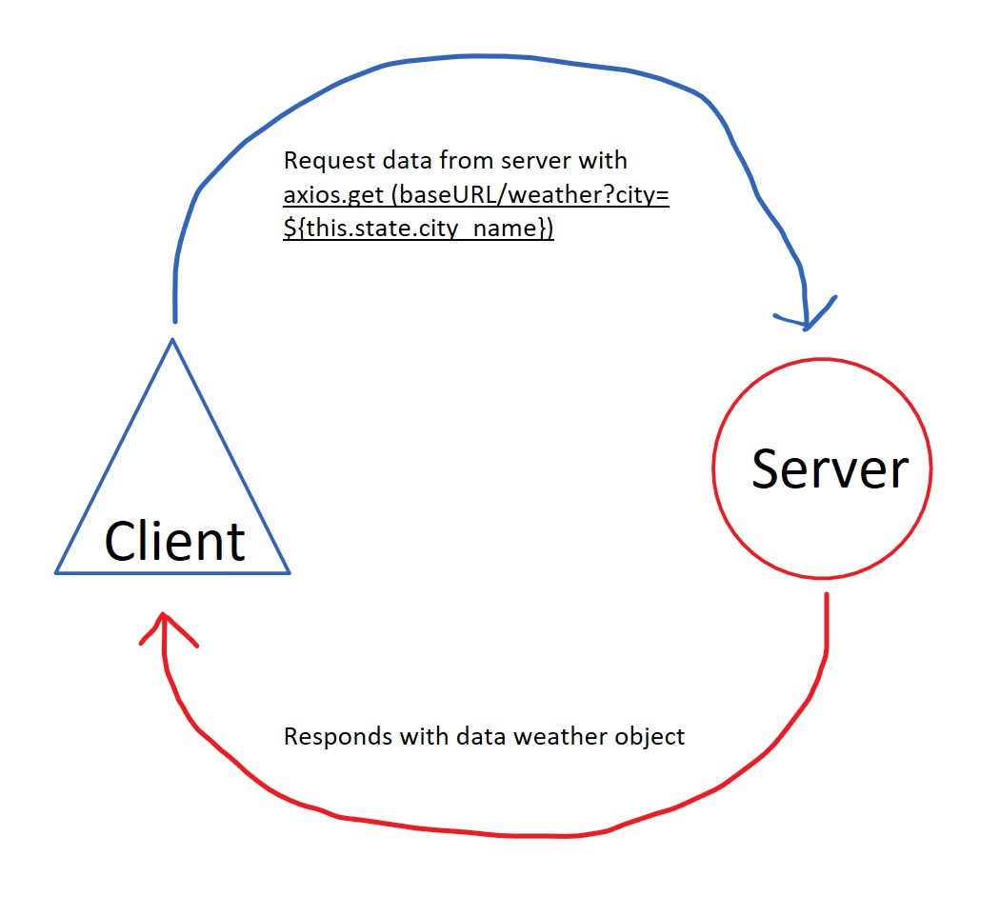
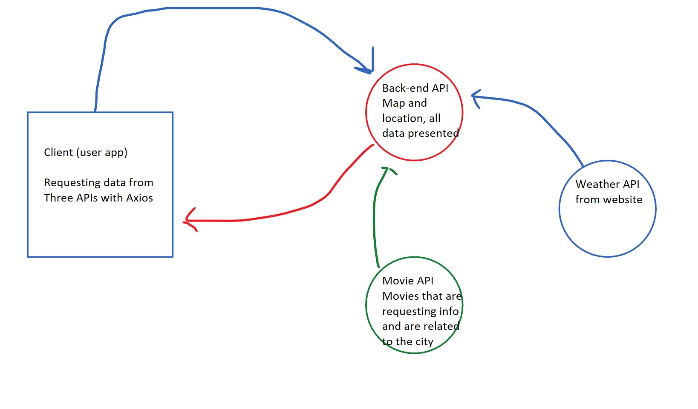

# City Explorer

**Author**: Carlos A. Herrera
**Version**: 1.0.1 <!-- (increment the patch/fix version number if you make more commits past your first submission) -->

## Overview
<!-- Provide a high level overview of what this application is and why you are building it, beyond the fact that it's an assignment for this class. (i.e. What's your problem domain?) -->
This app will render city maps and their coordinate location.

## Getting Started
<!-- What are the steps that a user must take in order to build this app on their own machine and get it running? -->
You will need an API key to get started. Make sure to see the env sample file for an example of how to import your API key.

## Architecture
<!-- Provide a detailed description of the application design. What technologies (languages, libraries, etc) you're using, and any other relevant design information. -->
Built with JavaScript, React, CSS, and React Bootstrap

## Change Log
<!-- Use this area to document the iterative changes made to your application as each feature is successfully implemented. Use time stamps. Here's an example:

01-01-2001 4:59pm - Application now has a fully-functional express server, with a GET route for the location resource. -->
08-24-2022 4:12pm - map and coordinate system renders without bugs. Error messages display accordingly.

## Credit and Collaborations
<!-- Give credit (and a link) to other people or resources that helped you build this application. -->
Thanks to the teaching staff at Code Fellows. Sheyna, Shane, and Michael are always a huge help and full of knowledge. And a thanks and acknowledgement to all of my classmates who helped and collaborated with me, especially David Suy and Jordan Yamada.

## Time Estimates

***

Name of feature: Set up React & API

Estimate of time needed to complete: 45min

Start time:1500

Finish time:1600

Actual time needed to complete: 1hr

* * *

Name of feature: Locations

Estimate of time needed to complete: 1.5hrs

Start time: 1620

Finish time: 1800

Actual time needed to complete:1hr40min

* * *

Name of feature: error messages

Estimate of time needed to complete: 30min

Start time: 1500 (the next day)

Finish time: 1600

Actual time needed to complete:1hr

* * *

## Resources

### Web request response cycle (WRRC) whiteboards

